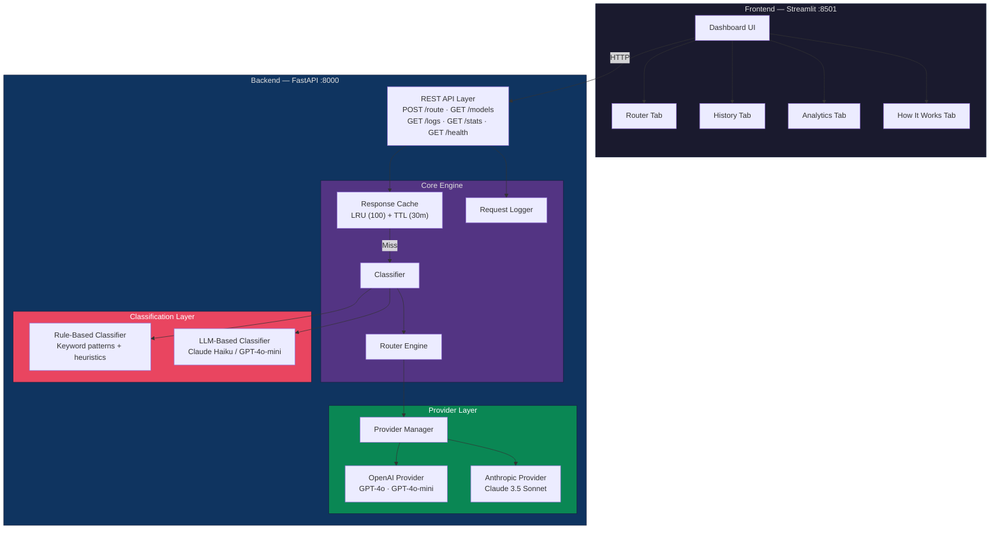
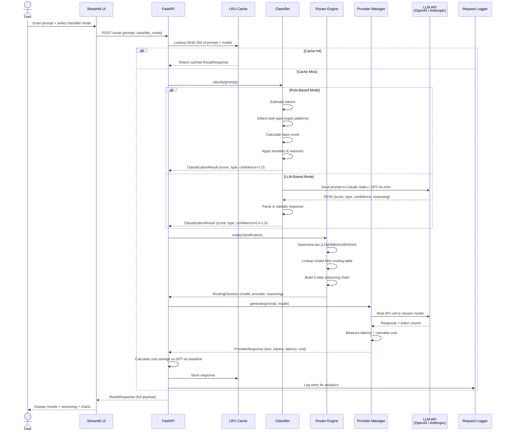
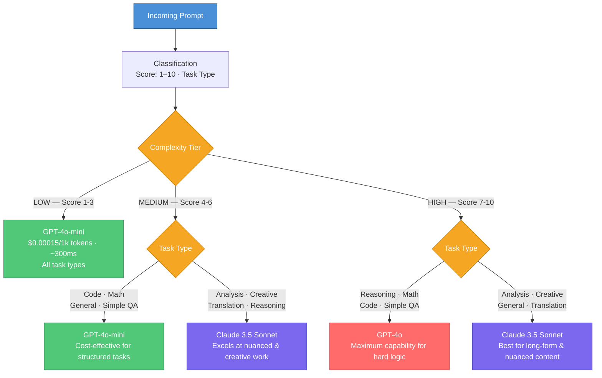
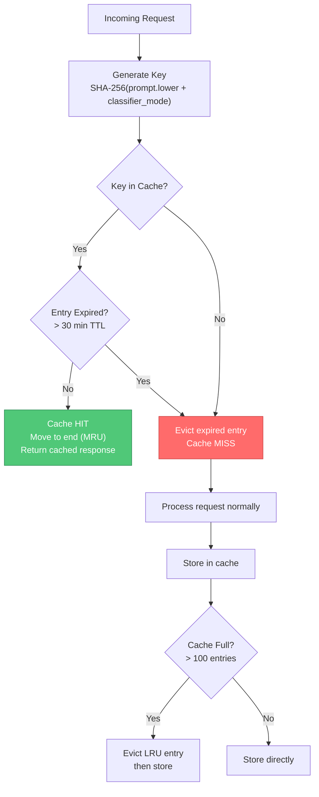

# AI Gateway — Intelligent LLM Router

> **An intelligent API gateway that analyzes prompt complexity in real-time and routes each request to the most cost-effective LLM — achieving up to 95% cost savings while maintaining response quality.**

All API calls are **real** — no mocks, no simulations. Every prompt is classified, routed, and answered by actual LLM APIs (OpenAI & Anthropic).

---

## Table of Contents

- [Why This Project?](#why-this-project)
- [Key Features](#key-features)
- [Architecture Overview](#architecture-overview)
- [End-to-End Request Flow](#end-to-end-request-flow)
- [Project Structure](#project-structure)
- [Tech Stack](#tech-stack)
- [Routing Logic](#routing-logic)
- [Classification Deep Dive](#classification-deep-dive)
- [Caching Strategy](#caching-strategy)
- [API Reference](#api-reference)
- [Dashboard](#dashboard)
- [Setup & Installation](#setup--installation)
- [Test Prompts](#test-prompts)
- [License](#license)

---

## Why This Project?

Using GPT-4o for every request is expensive ($0.005/1k input tokens) and slow (~800ms). But most prompts don't need the most powerful model. This gateway solves that:

| Scenario | Without Gateway | With Gateway | Savings |
|---|---|---|---|
| "What is 2+2?" | GPT-4o ($0.01) | GPT-4o-mini ($0.0003) | **97%** |
| "Write a haiku" | GPT-4o ($0.01) | Claude 3.5 Sonnet ($0.009) | **10%** + better quality |
| "Prove P ≠ NP" | GPT-4o ($0.01) | GPT-4o ($0.01) | 0% (correctly uses top model) |

The gateway intelligently routes each request to the **optimal model** based on complexity and task type — and provides **full transparency** into every routing decision through a 5-step reasoning chain.

---

## Key Features

- **Dual Classification Modes** — Rule-based (free, instant) or LLM-based (Claude Haiku, richer reasoning)
- **Smart Routing** — Maps (complexity tier × task type) to optimal model from a 3-model registry
- **Real API Calls** — Every response comes from actual OpenAI/Anthropic APIs
- **5-Step Reasoning Chain** — Full transparency into why each model was chosen
- **Cost Tracking** — Real-time comparison against GPT-4o baseline
- **LRU + TTL Cache** — Duplicate prompts served instantly, no wasted API calls
- **Interactive Dashboard** — Streamlit UI with routing, history, analytics, and architecture tabs

---

## Architecture Overview



---

## End-to-End Request Flow

This is exactly what happens when you submit a prompt:



---

## Project Structure

```
ai-gateway/
│
├── backend/                           # FastAPI Backend
│   ├── app/
│   │   ├── __init__.py
│   │   ├── main.py                    # API endpoints (POST /route, GET /models, /logs, /stats, /health)
│   │   ├── models.py                  # Pydantic v2 schemas — all enums, request/response models
│   │   ├── router.py                  # Routing engine — MODEL_REGISTRY + routing table + reasoning chain
│   │   ├── cache.py                   # In-memory LRU cache with TTL — SHA-256 key, thread-safe
│   │   ├── logger.py                  # Request log store + aggregated stats computation
│   │   │
│   │   ├── classifier/                # Prompt Classification Layer
│   │   │   ├── __init__.py
│   │   │   ├── rule_based.py          # Heuristic classifier — regex patterns, boosters, reducers
│   │   │   └── llm_based.py           # LLM classifier — real Claude Haiku / GPT-4o-mini API calls
│   │   │
│   │   └── providers/                 # LLM Provider Layer
│   │       ├── __init__.py
│   │       ├── base.py                # Abstract BaseProvider interface
│   │       ├── openai_provider.py     # Real OpenAI API — GPT-4o, GPT-4o-mini
│   │       ├── anthropic_provider.py  # Real Anthropic API — Claude 3.5 Sonnet
│   │       └── manager.py            # Provider dispatcher — routes to correct provider
│   │
│   ├── run.py                         # Uvicorn launcher script
│   └── requirements.txt               # Backend dependencies
│
├── frontend/                          # Streamlit Frontend
│   ├── app.py                         # Dashboard — 4 tabs (Router, History, Analytics, How It Works)
│   └── requirements.txt               # Frontend dependencies
│
├── .env.example                       # API key template
├── .gitignore
└── README.md
```

---

## Tech Stack

| Layer | Technology | Purpose |
|---|---|---|
| **Backend API** | FastAPI + Uvicorn | REST API server on port 8000 |
| **Data Models** | Pydantic v2 | Request/response validation & serialization |
| **LLM Providers** | OpenAI SDK, Anthropic SDK | Real API calls to GPT-4o, GPT-4o-mini, Claude 3.5 Sonnet |
| **Classifier LLM** | Claude Haiku 4.5 / GPT-4o-mini | LLM-based prompt classification |
| **Caching** | In-memory LRU + TTL | 100 entries, 30-min expiry, SHA-256 keys, thread-safe |
| **Frontend** | Streamlit + Plotly + Pandas | Interactive dashboard with charts |
| **Language** | Python 3.12 | Runtime |

---

## Routing Logic

The router maps **(complexity tier × task type)** to the optimal model:



### Routing Table

| Complexity Tier | Task Type | Routed Model | Provider | Rationale |
|---|---|---|---|---|
| **LOW** (1-3) | All types | GPT-4o-mini | OpenAI | Cheapest model handles simple tasks easily |
| **MEDIUM** (4-6) | Code, Math, General, Simple QA | GPT-4o-mini | OpenAI | Structured tasks don't need premium models |
| **MEDIUM** (4-6) | Analysis, Creative, Translation, Reasoning | Claude 3.5 Sonnet | Anthropic | Claude excels at nuance and creativity |
| **HIGH** (7-10) | Reasoning, Math, Code, Simple QA | GPT-4o | OpenAI | Maximum power for complex logic |
| **HIGH** (7-10) | Analysis, Creative, General, Translation | Claude 3.5 Sonnet | Anthropic | Best for sophisticated content generation |

### Model Registry

| Model | Provider | Input Cost/1k | Output Cost/1k | Avg Latency | Strengths |
|---|---|---|---|---|---|
| GPT-4o-mini | OpenAI | $0.00015 | $0.0006 | ~300ms | Fast, cheap, good for simple-to-moderate tasks |
| Claude 3.5 Sonnet | Anthropic | $0.003 | $0.015 | ~700ms | Nuanced reasoning, creative writing, analysis |
| GPT-4o | OpenAI | $0.005 | $0.015 | ~800ms | Top-tier logic, math, code (cost baseline) |

---

## Classification Deep Dive

### Rule-Based Classifier (Default)

Free, instant, and deterministic. Runs a 5-stage pipeline:


| Stage | What It Does |
|---|---|
| **Token Estimation** | Approximates token count: `max((words × 0.75 + chars / 4) / 2, 1)` |
| **Task Type Detection** | Matches against 7 regex pattern banks (code, math, creative, analysis, translation, reasoning, simple_qa). Most hits wins. Falls back to `general`. |
| **Base Score** | Assigns base complexity: simple_qa=2, translation=3, general=3, creative/code/analysis=5, math=6, reasoning=7. Adds +1 if >80 tokens, +2 if >200 tokens. |
| **Boosters** | "step by step", "comprehensive" → +2 · "compare", "explain" → +1 · "architect", "design pattern" → +2 |
| **Reducers** | "simple", "basic" → -1 · "yes or no" → -2 · Very short prompt (<30 chars) → -1 |

### LLM-Based Classifier

Uses a real LLM API call for semantic understanding:

| Setting | Anthropic (Default) | OpenAI |
|---|---|---|
| **Model** | Claude Haiku 4.5 | GPT-4o-mini |
| **Cost** | ~$0.0001 per classification | ~$0.0001 per classification |
| **Latency** | ~200-500ms | ~200-500ms |
| **Max Tokens** | 300 | 300 |
| **Temperature** | Default | 0.3 |
| **Output** | JSON with score, type, confidence, reasoning | Same |

The LLM receives a structured system prompt defining:
- Scoring guidelines (1-3: simple, 4-6: moderate, 7-10: complex)
- All 8 task type definitions
- Instruction to return raw JSON (no markdown fences)

Response is validated, clamped, and parsed with fallbacks for malformed output.

---

## Caching Strategy



| Parameter | Value |
|---|---|
| **Max Entries** | 100 |
| **TTL** | 30 minutes |
| **Eviction** | Least Recently Used (LRU) |
| **Key** | SHA-256 hash of `prompt.strip().lower() + "::" + classifier_mode` |
| **Thread Safety** | `threading.Lock` on all operations |
| **Stats** | Hit rate, size, hits/misses — visible in sidebar & `/health` |

---

## API Reference

### `POST /route` — Main Endpoint

Classify, route, and generate a response for any prompt.

**Request:**
```json
{
  "prompt": "Write a Python web scraper with error handling",
  "classifier_mode": "rule_based"
}
```

**Response:**
```json
{
  "request_id": "a1b2c3d4...",
  "prompt": "Write a Python web scraper with error handling",
  "classification": {
    "complexity_score": 6,
    "task_type": "code",
    "reasoning": "code keywords detected | base score 5 | boosted by: error handling mention",
    "confidence": 1.0,
    "classifier_mode": "rule_based"
  },
  "routing": {
    "model": "gpt-4o-mini",
    "provider": "openai",
    "reasoning_chain": [
      {"step": 1, "description": "Prompt classified as 'code' with complexity 6/10 (confidence: 1.0, classifier: rule_based)."},
      {"step": 2, "description": "Complexity 6 falls in the MEDIUM tier (range 4-6)."},
      {"step": 3, "description": "For MEDIUM complexity + 'code' tasks, routing to gpt-4o-mini — cost-effective for structured tasks."},
      {"step": 4, "description": "Estimated ~$0.0004/1k tokens vs $0.0100/1k (GPT-4o baseline) — ~96% cost reduction."},
      {"step": 5, "description": "Expected latency: ~300ms (baseline GPT-4o: ~800ms)."}
    ],
    "estimated_cost_per_1k_tokens": 0.000375,
    "estimated_latency_ms": 300
  },
  "response": {
    "model": "gpt-4o-mini",
    "response_text": "Here's a Python web scraper with error handling...",
    "tokens_used": 109,
    "latency_ms": 1407,
    "simulated_cost": 0.000058
  },
  "cost_comparison": {
    "chosen_cost": 0.000058,
    "baseline_cost": 0.001090,
    "savings_percent": 94.68
  },
  "timestamp": "2025-01-15T10:30:00Z"
}
```

### `GET /models` — Available Models

Returns metadata for all 3 models including pricing, latency, and strengths.

### `GET /logs?limit=50&offset=0` — Routing History

Paginated list of past routing decisions (newest first). Each entry includes: prompt snippet, classifier mode, complexity score, task type, routed model, latency, and cost.

### `GET /stats` — Aggregated Analytics

Returns:
- Total requests, total cost, total baseline cost, total savings, savings percentage
- Per-model breakdown: request count, cost, average latency
- Average complexity across all requests

### `GET /health` — Health Check

Returns system status, model count, cache stats (size, hit rate), and total requests logged.

---

## Dashboard

The Streamlit dashboard (port 8501) provides 4 tabs:

### Tab 1: Router
- Enter any prompt and select classifier mode (Rule-Based or LLM-Based)
- See **color-coded complexity score** (green < 3, orange 4-6, red 7-10)
- View selected model, task type, and **cost savings percentage**
- Read the full LLM response with token count, latency, and cost
- Inspect the **5-step reasoning chain** explaining the routing decision
- Cost comparison bar chart (chosen model vs GPT-4o baseline)

### Tab 2: History
- Sortable table of all past requests
- Columns: timestamp, prompt snippet, classifier, score, task type, model, latency, cost
- Color-coded rows by complexity

### Tab 3: Analytics
- **Top metrics**: Total requests, total cost, total savings, savings rate
- **Pie chart**: Model distribution by request count
- **Bar charts**: Cost by model, average latency by model
- **Gauge chart**: Overall savings percentage vs GPT-4o baseline

### Tab 4: How It Works
- Architecture overview with routing table
- Side-by-side comparison of both classifier modes
- Model comparison with pricing
- Caching strategy explanation

---

## Setup & Installation

### Prerequisites

- **Python 3.11+** (tested on 3.12)
- **OpenAI API key** — [platform.openai.com/api-keys](https://platform.openai.com/api-keys)
- **Anthropic API key** — [console.anthropic.com/settings/keys](https://console.anthropic.com/settings/keys)

### 1. Clone the repository

```bash
git clone https://github.com/tushar-chauhan-01/ai_prompt_gateway.git
cd ai-gateway
```

### 2. Create virtual environment

```bash
python3 -m venv venv
source venv/bin/activate        # macOS / Linux
# venv\Scripts\activate         # Windows
```

### 3. Install dependencies

```bash
pip install -r backend/requirements.txt
pip install -r frontend/requirements.txt
```

### 4. Configure API keys

```bash
cp .env.example .env
```

Edit `.env` with your keys:

```env
ANTHROPIC_API_KEY=sk-ant-...
OPENAI_API_KEY=sk-proj-...
CLASSIFIER_LLM_PROVIDER=anthropic    # or "openai"
```

| Variable | Required | Description |
|---|---|---|
| `ANTHROPIC_API_KEY` | Yes | Anthropic API key for Claude models |
| `OPENAI_API_KEY` | Yes | OpenAI API key for GPT models |
| `CLASSIFIER_LLM_PROVIDER` | No | `anthropic` (default) or `openai` — LLM used for classification |

### 5. Start the backend

```bash
python3 -m uvicorn backend.app.main:app --host 0.0.0.0 --port 8000
```

Verify:
```bash
curl http://localhost:8000/health
```

### 6. Start the frontend (new terminal)

```bash
source venv/bin/activate
python3 -m streamlit run frontend/app.py --server.port 8501
```

### 7. Open the dashboard

Navigate to **http://localhost:8501**

---

## Test Prompts

| Prompt | Expected Model | Complexity | Why |
|---|---|---|---|
| "What is 2+2?" | GPT-4o-mini | ~1 (LOW) | Simple QA — trivial question |
| "What is the capital of France?" | GPT-4o-mini | ~2 (LOW) | Simple QA — factual lookup |
| "Translate 'hello' to Spanish" | GPT-4o-mini | ~3 (LOW) | Translation — short, simple |
| "Write a Python function to reverse a string" | GPT-4o-mini | ~5 (MEDIUM) | Code — moderate complexity |
| "Write a haiku about the ocean" | Claude 3.5 Sonnet | ~5 (MEDIUM) | Creative — Claude excels here |
| "Compare REST vs GraphQL with pros and cons" | Claude 3.5 Sonnet | ~7 (HIGH) | Analysis — nuanced comparison |
| "Solve the integral of x² · eˣ dx step by step" | GPT-4o | ~8 (HIGH) | Math — complex calculus |
| "Explain quantum entanglement and its implications for computing" | GPT-4o | ~8 (HIGH) | Reasoning — deep explanation |

---

## License

MIT
