# AI Gateway — Intelligent LLM Router

An intelligent AI Gateway that routes LLM requests to the optimal model based on prompt complexity. It analyzes each prompt, scores its complexity, selects the best-fit model, generates a real response, and tracks cost savings — all visible through an interactive Streamlit dashboard.

## Why This Project?

Using GPT-4o for every request is expensive and slow. Most prompts don't need the most powerful model. This gateway automatically routes:

- **Simple questions** → GPT-4o-mini (fast, cheap)
- **Moderate tasks** → GPT-4o-mini or Claude 3.5 Sonnet (balanced)
- **Complex reasoning** → GPT-4o or Claude 3.5 Sonnet (maximum capability)

The result: **real cost savings** while maintaining response quality, with full transparency into every routing decision.

---

## Architecture

```mermaid
flowchart TD
    A["🔤 User Prompt"] --> B["🧠 Classifier\nRule-based heuristics or LLM-based (Claude Haiku)\nOutputs: complexity score (1-10) + task type"]
    B --> C["🔀 Router\nMaps (complexity tier + task type) → optimal model\nGenerates reasoning chain + cost estimate"]
    C --> D["⚡ Provider\nReal API calls to OpenAI / Anthropic\nGPT-4o · GPT-4o-mini · Claude 3.5 Sonnet"]
    D --> E["📊 Response + Analytics\nCached, logged, and returned\nwith full routing reasoning + cost comparison"]

    style A fill:#4A90D9,stroke:#2C5F8A,color:#fff
    style B fill:#F5A623,stroke:#C47D0E,color:#fff
    style C fill:#7B68EE,stroke:#5A4FCF,color:#fff
    style D fill:#50C878,stroke:#2E8B57,color:#fff
    style E fill:#FF6B6B,stroke:#CC4444,color:#fff
```



---

## Tech Stack

| Layer | Technology |
|---|---|
| Backend API | FastAPI + Uvicorn |
| LLM Providers | OpenAI API (GPT-4o, GPT-4o-mini), Anthropic API (Claude 3.5 Sonnet) |
| Classifier | Rule-based heuristics + LLM-based (Claude Haiku) |
| Caching | In-memory LRU with TTL (100 entries, 30 min expiry) |
| Frontend | Streamlit + Plotly |
| Data Models | Pydantic v2 |

---

## Project Structure

```
ai-gateway/
├── backend/
│   ├── app/
│   │   ├── __init__.py
│   │   ├── main.py                  # FastAPI app — all endpoints
│   │   ├── models.py                # Pydantic schemas (request/response/enums)
│   │   ├── router.py                # Routing engine + model registry
│   │   ├── cache.py                 # In-memory LRU + TTL response cache
│   │   ├── logger.py                # Request log store + stats aggregation
│   │   ├── classifier/
│   │   │   ├── __init__.py
│   │   │   ├── rule_based.py        # Heuristic classifier (keywords, token count)
│   │   │   └── llm_based.py         # Real LLM classifier (Claude Haiku / GPT-4o-mini)
│   │   └── providers/
│   │       ├── __init__.py
│   │       ├── base.py              # Abstract provider interface
│   │       ├── openai_provider.py   # OpenAI API (GPT-4o, GPT-4o-mini)
│   │       ├── anthropic_provider.py # Anthropic API (Claude 3.5 Sonnet)
│   │       └── manager.py           # Provider dispatcher
│   ├── run.py                       # Uvicorn launcher
│   └── requirements.txt
├── frontend/
│   ├── app.py                       # Streamlit dashboard (3 tabs)
│   └── requirements.txt
├── .env.example                     # Template for API keys
└── README.md
```

---

## API Endpoints

| Method | Endpoint | Description |
|---|---|---|
| `POST` | `/route` | Classify + route + generate response (main endpoint) |
| `GET` | `/models` | List available models with pricing and metadata |
| `GET` | `/logs` | Routing history (newest first, supports `limit` and `offset`) |
| `GET` | `/stats` | Aggregated analytics: cost savings, model distribution |
| `GET` | `/health` | Health check with cache stats |

### Example: POST /route

**Request:**
```json
{
  "prompt": "Write a Python web scraper with error handling",
  "classifier_mode": "rule_based"
}
```

**Response:**
```json
{
  "request_id": "abfe8a18...",
  "classification": {
    "complexity_score": 6,
    "task_type": "code",
    "reasoning": "code-related keywords detected | base score 5 ...",
    "confidence": 1.0,
    "classifier_mode": "rule_based"
  },
  "routing": {
    "model": "gpt-4o-mini",
    "provider": "openai",
    "reasoning_chain": [
      {"step": 1, "description": "Prompt classified as 'code' with complexity 6/10 ..."},
      {"step": 2, "description": "Complexity 6 falls in the MEDIUM tier (range 4-6)."},
      {"step": 3, "description": "For MEDIUM complexity + 'code' tasks, routing to gpt-4o-mini ..."},
      {"step": 4, "description": "Estimated ~$0.0004/1k tokens vs $0.0100/1k (GPT-4o baseline) — ~96% cost reduction."},
      {"step": 5, "description": "Expected latency: ~300ms (baseline GPT-4o: ~800ms)."}
    ]
  },
  "response": {
    "model": "gpt-4o-mini",
    "response_text": "Here's a Python web scraper with error handling...",
    "tokens_used": 109,
    "latency_ms": 1407,
    "simulated_cost": 0.000058
  },
  "cost_comparison": {
    "chosen_cost": 0.000058,
    "baseline_cost": 0.001090,
    "savings_percent": 94.68
  }
}
```

---

## Routing Logic


---

## Classifier Modes

### Rule-Based (Default)
- Free, instant, deterministic
- Uses keyword pattern matching, token count estimation, and complexity boosters/reducers
- Always returns confidence = 1.0

### LLM-Based
- Sends the prompt to Claude Haiku (or GPT-4o-mini) for classification
- Returns richer reasoning and variable confidence scores
- Costs a small amount per classification call (~$0.0001)

---

## Setup & Run (End to End)

### Prerequisites

- **Python 3.11+** (tested on 3.12)
- **OpenAI API key** — [Get one here](https://platform.openai.com/api-keys)
- **Anthropic API key** — [Get one here](https://console.anthropic.com/settings/keys)

### Step 1: Clone the repository

```bash
git clone <your-repo-url>
cd ai-gateway
```

### Step 2: Create and activate a virtual environment

**macOS / Linux:**
```bash
python3 -m venv venv
source venv/bin/activate
```

**Windows:**
```bash
python -m venv venv
venv\Scripts\activate
```

### Step 3: Install dependencies

```bash
pip install -r backend/requirements.txt
pip install -r frontend/requirements.txt
```

### Step 4: Configure API keys

```bash
cp .env.example .env
```

Open `.env` and add your keys:

```
ANTHROPIC_API_KEY=sk-ant-...
OPENAI_API_KEY=sk-proj-...
CLASSIFIER_LLM_PROVIDER=anthropic
```

| Variable | Description |
|---|---|
| `ANTHROPIC_API_KEY` | Your Anthropic API key (required) |
| `OPENAI_API_KEY` | Your OpenAI API key (required) |
| `CLASSIFIER_LLM_PROVIDER` | `anthropic` (default) or `openai` — which LLM to use for the LLM-based classifier |

### Step 5: Start the backend

```bash
python3 -m uvicorn backend.app.main:app --host 0.0.0.0 --port 8000
```

Verify it's running:
```bash
curl http://localhost:8000/health
```

### Step 6: Start the frontend (new terminal)

```bash
# Make sure the virtual environment is activated in this terminal too
source venv/bin/activate

python3 -m streamlit run frontend/app.py --server.port 8501
```

### Step 7: Open the dashboard

Go to **http://localhost:8501** in your browser.

---

## Test Prompts to Try

| Prompt | Expected Route | Why |
|---|---|---|
| "What is 2+2?" | GPT-4o-mini | Simple QA, score ~1 |
| "What is the capital of France?" | GPT-4o-mini | Simple QA, score ~1 |
| "Write a Python function to reverse a string" | GPT-4o-mini | Code, score ~4-5 |
| "Write a haiku about the ocean" | Claude 3.5 Sonnet | Creative, score ~4 |
| "Analyze pros and cons of microservices vs monolith in detail" | Claude 3.5 Sonnet | Analysis, score ~7-8 |
| "Solve the integral of x^2 * e^x dx step by step" | GPT-4o | Math, score ~8 |
| "Explain quantum entanglement to a 5-year-old" | GPT-4o | Reasoning, score ~8 |

---

## Dashboard Features

### Router Tab
- Enter any prompt and select classifier mode
- See complexity score (color-coded), task type, selected model, and cost savings
- View the full model response with token count, latency, and cost
- Inspect the 5-step reasoning chain explaining every routing decision
- Cost comparison bar chart (chosen model vs GPT-4o baseline)

### History Tab
- Sortable table of all past requests
- Shows prompt snippet, classifier used, complexity score, routed model, latency, and cost

### Analytics Tab
- Top-level metrics: total requests, cost, savings, savings rate
- Pie chart: model distribution by request count
- Bar charts: cost and latency per model
- Gauge chart: overall savings percentage vs GPT-4o baseline

---

## Caching

Duplicate prompts (same text + same classifier mode) are served from cache instantly, skipping the API call entirely. The cache uses:

- **LRU eviction** — max 100 entries, least recently used evicted first
- **TTL expiry** — entries expire after 30 minutes
- **Thread-safe** — safe for concurrent requests

Cache stats are visible in the sidebar and at `GET /health`.

---

## License

MIT
